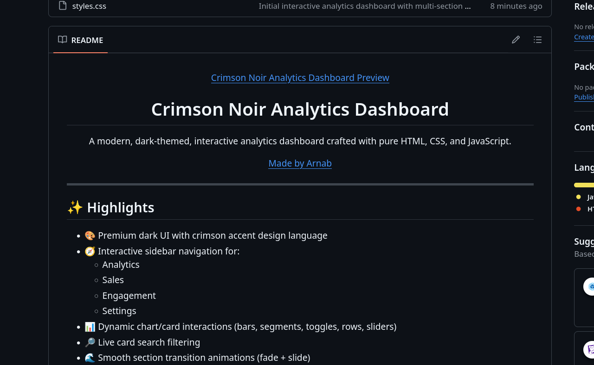

<p align="center">
  
</p>

<h1 align="center">Analytics Dashboard</h1>

<p align="center">
  A modern, dark-themed, interactive analytics dashboard crafted with pure HTML, CSS, and JavaScript.
</p>

<p align="center">
  <a href="https://arnazz10.github.io">Made by Arnab</a>
</p>

---

## ✨ Highlights

- 🎨 Premium dark UI with crimson accent design language
- 🧭 Interactive sidebar navigation for:
  - Analytics
  - Sales
  - Engagement
  - Settings
- 📊 Dynamic chart/card interactions (bars, segments, toggles, rows, sliders)
- 🔎 Live card search filtering
- 🌊 Smooth section transition animations (fade + slide)
- 📱 Responsive layout for desktop and mobile

---

## 🧩 Tech Stack

- **HTML5**
- **CSS3**
- **Vanilla JavaScript (ES6+)**

No external frameworks required.

---

## 🚀 Run Locally

```bash
# clone
git clone https://github.com/Arnazz10/Analytics-Dashboard.git

# open project
cd Analytics-Dashboard

# serve locally (example with Vite preview already used)
# or open index.html directly
```

If you're using a local dev server, open:

`http://127.0.0.1:4173`

---

## ☁️ Deploy on Vercel

1. Push code to GitHub
2. Import repo in Vercel
3. Keep framework as **Other**
4. Deploy

Vercel will auto-generate a production URL.

---

## 📸 Add Your Screenshot (for the top preview)

Place your screenshot file here:

`assets/dashboard-preview.png`

The README is already configured to show it at the top.

---

## 📂 Project Structure

```text
Analytics-Dashboard/
├── index.html
├── styles.css
├── script.js
└── README.md
```

---

## 📄 License

This project is for learning/demo purposes.
